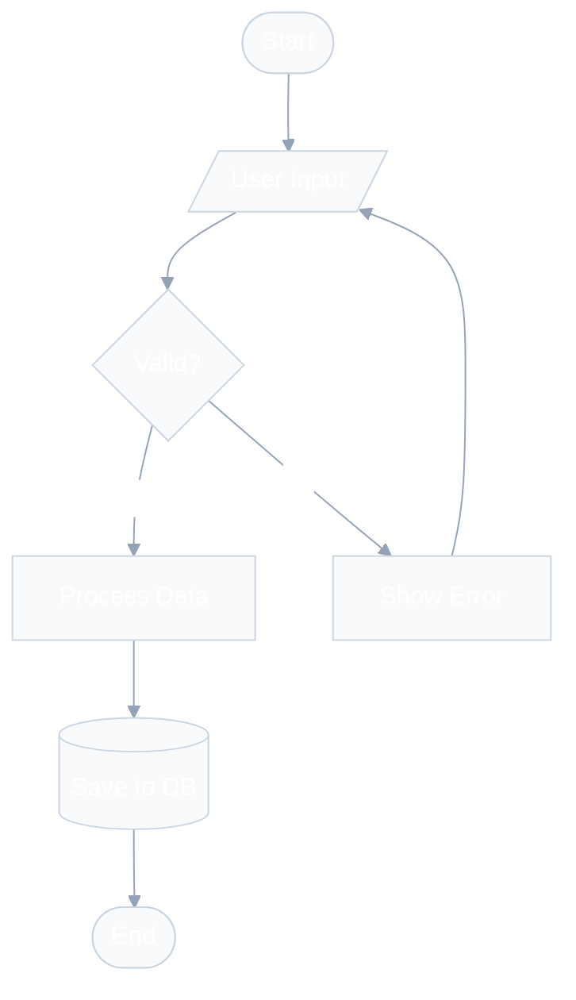
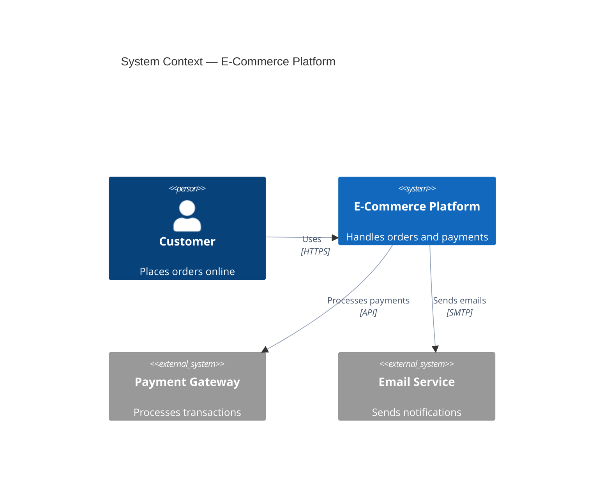

# Mermaid Studio

Criação, validação e renderização multiformato de diagramas Mermaid de nível especializado. Cria diagramas a partir de descrições ou análise de código, valida sintaxe e renderiza para SVG, PNG ou ASCII com temas profissionais.

## Regras de Ouro — Diagramas Elegantes por Padrão

Cada diagrama DEVE seguir estes princípios. Eles não são opcionais – eles definem a diferença entre um diagrama medíocre e um padrão ouro.

### Regra 1: Sempre use uma diretiva Init para estilo profissional

**NUNCA** crie um diagrama sem uma diretiva `%%{init}` ou configuração do frontmatter. O tema padrão do Mermaid produz linhas pretas fortes e cores genéricas. Sempre aplique uma paleta selecionada.

**Para diagramas gerais (fluxograma, sequência, estado, classe, ERD):**

```
%%{init: {'theme': 'base', 'themeVariables': {
  'primaryColor': '#4f46e5', 'primaryTextColor': '#ffffff',
  'primaryBorderColor': '#3730a3', 'lineColor': '#94a3b8',
  'secondaryColor': '#10b981', 'tertiaryColor': '#f59e0b',
  'background': '#ffffff', 'mainBkg': '#f8fafc',
  'nodeBorder': '#cbd5e1', 'clusterBkg': '#f1f5f9',
  'clusterBorder': '#e2e8f0', 'titleColor': '#1e293b',
  'edgeLabelBackground': '#ffffff', 'textColor': '#334155'
}}}%%
```

**⚠️ Aviso de fonte:** NÃO defina `fontFamily` nas variáveis ​​do tema. A fonte padrão Mermaid (`trebuchet ms, verdana, arial, sans-serif`) funciona em qualquer lugar. Definir `system-ui`, `Segoe UI` ou `-apple-system` será renderizado como Times New Roman no Chromium headless (usado por `mmdc`).

**Para diagramas C4 — consulte a seção dedicada de estilo C4 abaixo.**

**Para diagramas de arquitetura beta — consulte a seção AWS/Arquitetura dedicada abaixo.**

### Regra 2: Linhas suaves, preto nunca áspero

A maior melhoria visual é usar `lineColor: '#94a3b8'` (slate-400) em vez do preto padrão. Isso cria um diagrama moderno e respirável. Para temas escuros, use `lineColor: '#64748b'` (slate-500).

### Regra 3: Limite de Densidade – Respire

- Máximo de 15 nós por diagrama (não 20 – menos é mais elegante)
- Use `subgraph` ou limites para criar espaços em branco e agrupamento visual
- Prefira LR (esquerda-direita) para fluxos de processo — a leitura é mais natural
- Use links invisíveis (`A ~~~ B`) para adicionar espaçamento quando o layout estiver apertado

### Regra 4: rótulos significativos e estilo consistente

- IDs de nó: camelCase (`orderService`, não `s1` ou `os`)
- Rótulos: linguagem natural curta e clara (`[Serviço de pedido]`)
- Setas: verbos de ação com informações de protocolo (`"Envia pedido via gRPC"`)
- Descrições: unifilar, com foco na função (`"Lida com o ciclo de vida do pedido"`)

### Regra 5: Harmonia de cores em vez de variedade de cores

Use no máximo 3-4 cores por diagrama. Mapeie as cores para o significado:

- **Tons azuis** (#4f46e5, #3b82f6) → sistemas primários, serviços internos
- **Tons verdes** (#10b981, #059669) → estados de sucesso, armazenamentos de dados
- **Tons âmbar** (#f59e0b, #d97706) → sistemas externos, avisos
- **Tons de ardósia** (#64748b, #94a3b8) → linhas, bordas, elementos secundários
- **Tons vermelhos** (#ef4444) → SOMENTE erros, nunca como decoração

## Modos de operação

Esta habilidade opera em três modos com base na intenção do usuário:

| Modo           | Gatilho                                                  | O que acontece           |
| -------------- | -------------------------------------------------------- | ------------------------ |
| **Criar**      | "desenhe um diagrama de...", "visualize meu..."          | Gera apenas código .mmd  |
| **Renderizar** | "renderizar esta sereia", "converter para SVG/PNG/ASCII" | Renderiza .mmd existente |
| **Completo**   | "criar e renderizar...", solicitações ambíguas           |

Criar → Validar → Renderizar |

O padrão é o modo **Completo** quando a intenção não está clara.

## Etapa 1: Entenda a solicitação

Antes de escrever qualquer código Mermaid, determine:

1. **O que diagramar** — sistema, fluxo, esquema, arquitetura, estrutura de código?
2. **Qual tipo de diagrama** — use a Matriz de Decisão abaixo
3. **Formato de saída** — somente código, SVG, PNG ou ASCII?
4. **Preferência de tema** — pergunte apenas se for renderização; padrão para o tema `base` com paleta selecionada

### Matriz de decisão do tipo de diagrama

| O usuário descreve...                                        | Tipo de diagrama | Palavra-chave de sintaxe |
| ------------------------------------------------------------ | ---------------- | ------------------------ |
| Processo, algoritmo, árvore de decisão, fluxo de trabalho    | Fluxograma       | `fluxograma TD/LR`       |
| Chamadas de API, passagem de mensagens, solicitação/resposta | Sequência        | `sequenceDiagram`        |
| Esquema de banco de dados, relacionamentos de tabelas        | DER              | `erDiagrama`             |

| Classes OOP, modelo de domínio, interfaces | Classe | `classDiagrama` |
| Máquina de estados, ciclo de vida, transições | Estado | `stateDiagram-v2` |
| Visão geral do sistema de alto nível (C4 Nível 1) | Contexto C4 | `C4Contexto` |
| Aplicações, bases de dados, serviços (C4 Nível 2) | Contêiner C4 | `C4Container` |
| Componentes internos (C4 Nível 3) | Componente C4 | `C4Component` |

| Fluxos de solicitação com etapas numeradas | C4 Dinâmico | `C4Dinâmico` |
| Infraestrutura, implantação em nuvem | Implantação C4 | `Implantação C4` |
| Serviços em nuvem com ícones (AWS/GCP/Azure) | Arquitetura | `arquitetura-beta` |
| Cronograma do projeto, agendamento | Gantt | `gantt` |
| Dados proporcionais, percentagens | Torta | `torta` |

| Brainstorming, ideias hierárquicas | Mapa mental | `mapa mental` |
| Eventos históricos, cronologia | Linha do tempo | `linha do tempo` |
| Estratégia de ramificação, histórico do git | Gráfico Git | `gitGraph` |
| Quantidades de fluxo, distribuição de recursos | Sankey | `sankey-beta` |
| Visualização de dados X/Y | Gráfico XY | `xychart-beta` |

| Matriz de prioridades, posicionamento estratégico | Quadrante | `quadrantChart` |
| Controle de layout, posicionamento de grade | Bloco | `bloco-beta` |
| Pacotes de rede, cabeçalhos de protocolo | Pacote | `pacote-beta` |
| Quadros de tarefas, fluxo de trabalho kanban | Kanban | `kanban` |
| Experiência do usuário, pontuação de satisfação | Jornada do usuário | `jornada` |

| Rastreabilidade dos requisitos do sistema | Requisito | `requirementDiagram` |

Se a descrição do usuário não corresponder claramente a um tipo, sugira de 2 a 3 opções com uma breve justificativa para cada uma e deixe-o escolher.

### Quando carregar referências

Carregue arquivos de referência SOMENTE quando necessário para o tipo de diagrama específico:

- **Diagramas C4** → Leia `references/c4-architecture.md` ANTES de escrever o código
- **Arquitetura AWS/Cloud** → Leia `references/aws-architecture.md` ANTES de escrever o código
- **Code-to-diagram** → Leia `references/code-to-diagram.md` ANTES de analisar
- **Temas/estilos** → Leia `references/themes.md` quando o usuário solicitar temas personalizados
- **Erros de sintaxe** → Leia `references/troubleshooting.md` quando a validação falhar
- **Qualquer detalhe do tipo de diagrama** → Leia `r

eferences/diagram-types.md` para sintaxe abrangente

## Etapa 2: Crie o Diagrama

### 2.1 - Escreva o código da sereia

Siga estes princípios em ordem de prioridade:

1. **Elegância em primeiro lugar** — cada diagrama deve ter uma aparência profissional com diretivas de inicialização e cores selecionadas
2. **Correção** — sintaxe válida que é renderizada sem erros
3. **Clareza** — rótulos significativos, direção lógica do fluxo, relacionamentos claros
4. **Simplicidade** — menos de 15 nós por diagrama; dividir sistemas complexos em múltiplos
5. **Consistência** — nomenclatura uniforme (camelCase para IDs, rótulos descritivos entre colchetes)

### 2.2 — Regras de Estrutura

```

%% Diagram: [Purpose] | Author: [auto] | Date: [auto]
%%{init: {'theme': 'base', 'themeVariables': { ... }}}%%
[diagramType]
    [content]
```

**CRÍTICO:** A diretiva `%%{init}` DEVE ir na primeira linha sem comentários, ANTES da declaração do tipo de diagrama. Como alternativa, use o frontmatter YAML no início absoluto do arquivo.

**Convenções de nomenclatura:**

- IDs de nó: camelCase, descritivo (`orderService`, não `s1`)
- Etiquetas: linguagem natural entre colchetes (`[Serviço de Pedido]`)
- Relacionamentos: verbos de ação (`"Envia pedido para"`, `"Lê de"`)

**Layout Boas práticas:**

- `TD` (top-down) para fluxos e processos hierárquicos
- `LR` (esquerda-direita) para cronogramas, pipelines e processos sequenciais
- `RL` para contextos de leitura da direita para a esquerda
- Use `subgraph` para agrupar nós relacionados; nomear subgráficos de forma significativa
- Adicione `direção` dentro dos subgráficos quando necessário para fluxos diferentes

### 2.3 — Exemplos de referência rápida

**Fluxograma (com estilo profissional):**



Para exemplos de diagramas de sequência e estilos de ERD, leia `references/themes.md`.

**Contexto C4 (com estilo elegante OBRIGATÓRIO):**



**Arquitetura (AWS com ícones Iconify):**

```mermaid
architecture-beta
    group vpc(logos:aws-vpc)[VPC]

    service api(logos:aws-api-gateway)[API Gateway] in vpc
    service lambda(logos:aws-lambda)[Lambda] in vpc
    service db(logos:aws-dynamodb)[DynamoDB] in vpc
    service s3(logos:aws-s3)[S3 Bucket]

    api:R --> L:lambda
    lambda:R --> L:db
    lambda:B --> T:s3
```



**IMPORTANTE:** Diagramas de arquitetura beta com ícones `logos:*` requerem registro de pacote de ícones. Ao renderizar com o script de renderização, use o sinalizador `--icons logos`. Se estiver renderizando em um visualizador de markdown que não suporta pacotes de ícones, use os ícones integrados (`nuvem`, `banco de dados`, `disco`, `servidor`, `internet`) como substituto. Leia `references/aws-architecture.md` para obter o catálogo completo de ícones e instruções de renderização.

Para uma sintaxe abrangente de TODOS os tipos de diagramas, leia `references/diagram-types.md`.

## Diagramas C4 – Guia de estilo obrigatório

Os diagramas C4 têm **estilo de elemento fixo** (caixas azuis para sistemas, cinza para pessoas, etc.), mas suas **linhas de relacionamento são padronizadas em preto forte**, o que cria ruído visual. Você DEVE aplicar estas regras de estilo:

### O padrão de estilo C4

Todo diagrama C4 DEVE incluir estas diretivas no final:```
%% === MANDATORY STYLING ===
%% Apply soft line colors to ALL relationships
UpdateRelStyle(fromAlias, toAlias, $textColor="#475569", $lineColor="#94a3b8")
%% Repeat for each Rel() in the diagram

    %% Optimize layout spacing
    UpdateLayoutConfig($c4ShapeInRow="3", $c4BoundaryInRow="1")

````
### Referência de valores de cores C4

| Finalidade | Cor | Hexágono | Notas |
| ----------------- | --------- | --------- | ---------------------------------------- |
| Cor da linha suave | Ardósia-400 | `#94a3b8` | Substitui o preto padrão severo |
| Cor do texto da linha | Ardósia-600 | `#475569` | Legível, mas não dominante |
| Linha de destaque | Azul-400 | `#60a5fa` | Para relacionamentos destacados ou primários |
| Guerra

linha de mineração | Âmbar-500 | `#f59e0b` | Para conexões externas/de risco |
| Elemento personalizado bg | Esmeralda | `#10b981` | Para armazenamentos de dados ou destaques de sucesso |
| Elemento personalizado bg | Índigo | `#4f46e5` | Para ênfase no sistema primário |

### Dicas de layout C4

**CRÍTICO — Máximo de 6 `Rel()` por diagrama.** Mais de 6 relacionamentos fazem com que Dagre direcione setas através dos nós, criando um espaguete ilegível. Se o seu sistema precisar de mais conexões, divida-o em vários diagramas específicos.

- Use `$c4ShapeInRow="3"` para a maioria dos diagramas (evita aglomeração horizontal)
- Use `$c4ShapeInRow="2"` para diagramas com rótulos longos
- Use `$c4BoundaryInRow="1"` sempre (empilha os limites verticalmente para maior clareza)
- Aplique `$offsetY="-10"` a `UpdateRelStyle` quando os rótulos se sobrepõem aos elementos
- Prefira topologias em forma de árvore (1 entrada, 1-2 saídas por nó) em vez de topologias de malha
- Declarar elementos em ordem de fluxo — a ordem das declarações `Container()` afeta

layout
- Use `Rel_D`, `Rel_R` direcional, etc. apenas como último recurso quando o layout automático criar sobreposição

Para sintaxe, exemplos e padrões abrangentes do C4, leia `references/c4-architecture.md`.

## Etapa 3: Validar

Antes de renderizar, SEMPRE valide a sintaxe Mermaid:

```bash
node $SKILL_DIR/scripts/validate.mjs <file.mmd>
````

Se a validação falhar:

1. Leia a mensagem de erro com atenção
2. Consulte `references/troubleshooting.md` para soluções comuns
3. Corrija a sintaxe e revalide
4. Máximo de 3 tentativas de correção antes de pedir esclarecimentos ao usuário

## Etapa 4: Renderizar

### 4.1 — Configuração (apenas na primeira execução)

```bash

bash $SKILL_DIR/scripts/setup.sh
```

Isso instala automaticamente os mecanismos de renderização e as dependências do pacote de ícones. Execute uma vez por ambiente.

### 4.2 — Renderização de Diagrama Único

```bash

# SVG (default — best quality)
node $SKILL_DIR/scripts/render.mjs -i diagram.mmd -o diagram.svg

# PNG (for documents/presentations)
node $SKILL_DIR/scripts/render.mjs -i diagram.mmd -o diagram.png --width 1200

# ASCII (for terminals/READMEs)
node $SKILL_DIR/scripts/render-ascii.mjs -i diagram.mmd

# With icon packs (architecture-beta with AWS/tech icons)
node $SKILL_DIR/scripts/render.mjs -i diagram.mmd -o diagram.svg --icons logos,fa
```

O sinalizador `--icons` registra os pacotes Iconify antes da renderização. Pacotes: `logos` (AWS/tech), `fa` (Font Awesome). Use `logotipos` para AWS.

### 4.3 — Renderização em lote

Para vários diagramas de uma só vez:

```bash
node $SKILL_DIR/scripts/batch.mjs \
  --input-dir ./diagrams \
  --output-dir ./rendered \
  --format svg \
  --theme default \
  --workers 4
```

### 4.4 — Temas Disponíveis

**linda-sereia (15):** `noite de Tóquio` | `tóquio-noite-tempestade` | `tóquio-luz noturna` | `drácula` | `norte` | `nord-light` | `catppuccin-mocha` | `catppuccin-latte` | `github-escuro` | `github-light` | `escuro solarizado` | `luz solarizada` | `one-escuro` | `zinco-escuro` | `zinco-light`

**sereia-cli nativo (5):** `default` | `floresta` | `escuro` | `neutro` | `base`

Tema personalizado: `--theme base --config '{"theme":"base","themeVariables":{"primaryColor":"#4f46e5","lineColor":"#94a3b8"}}'`

Para o catálogo completo de temas, leia `references/themes.md`. O script de renderização seleciona automaticamente o melhor mecanismo (mmdc primário, substituto da bela sereia, Puppeteer para pacotes de ícones).

## Etapa 5: código para diagrama (quando solicitado)

Quando o usuário pede para visualizar o código ou arquitetura existente:

1. Leia `references/code-to-diagram.md` para a metodologia de análise
2. Analise a base de código para identificar o tipo de diagrama correto:
   - Dependências do módulo → Fluxograma ou diagrama de classes
   - Rotas e manipuladores de API → Diagrama de sequência
   - Modelos/esquemas de banco de dados → ERD
   - Arquitetura de serviço → Contêiner C4 ou diagrama de arquitetura
   - Máquinas de estado em código → Diagrama de estado
3. Gere o arquivo .mmd **com diretivas de inicialização adequadas** (Regra de ouro 1)
   4

. Valide e renderize normalmente

## Solução de problemas Referência rápida

| Sintoma                      | Causa provável    | Correção                                        |
| ---------------------------- | ----------------- | ----------------------------------------------- |
| O diagrama não é renderizado | Erro de sintaxe   | Execute valid.mjs, verifique colchetes/aspas    |
| Etiquetas cortadas           | Texto muito longo | Encurte rótulos ou use quebras de linha `<br/>` |
| O layout parece errado       | Errado            |

recção | Experimente diferentes TD/LR/BT/RL |
| Sobreposição de nós | Muitos nós | Dividir em subgráficos ou múltiplos diagramas |
| Linhas muito escuras/grossas | Nenhuma diretiva de inicialização | Adicione `%%{init}` com `lineColor: '#94a3b8'` |
| Linhas C4 sobrepostas | Nenhum estilo aplicado | Adicione `UpdateRelStyle` com deslocamentos para cada Rel |
| Ícones da AWS não exibidos | Nenhum pacote de ícones | Use `--icons logos` f

atraso ou fallback para ícones integrados |
| `mmdc` não encontrado | Não instalado | Execute `setup.sh` |
| Tema não aplicado | Motor errado | temas de linda sereia só funcionam com esse mecanismo |

Para solução de problemas abrangente, leia `references/troubleshooting.md`.

## Convenções de saída

- Salve arquivos de origem .mmd junto com as saídas renderizadas
- Nomenclatura: `{propósito}-{tipo}.mmd` (por exemplo, `auth-flow-sequence.mmd`)
- Para lote: mantenha o nome do arquivo de entrada, altere a extensão
- Sempre forneça a fonte .mmd e o arquivo renderizado ao usuário
