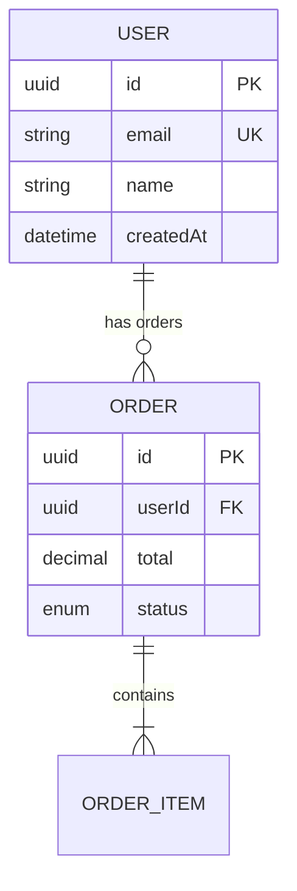

# Code-to-Diagram — Metodologia de Análise

Carregue este arquivo quando o usuário solicitar a visualização do código existente, a análise de uma base de código ou a geração de diagramas a partir de arquivos de origem.

## Fluxo de trabalho

1. **Identifique o escopo** — que parte do código diagramar
2. **Escolha a estratégia de análise** — quais padrões procurar
3. **Extraia a estrutura** — leia os arquivos relevantes
4. **Selecione o tipo de diagrama** — com base no que foi encontrado
5. **Gerar diagrama** — criar arquivo .mmd
6. **Validar e renderizar** — como sempre

## Estratégias de análise por tipo de solicitação

### "Mostre-me a arquitetura"

**O que procurar:**

- Estrutura raiz do projeto (pastas, pontos de entrada)
- Package.json/pyproject.toml/Cargo.toml para dependências
- Arquivos Docker, docker-compose.yml para serviços
- Infraestrutura como código (CDK, Terraform, CloudFormation, Pulumi)
- Variáveis de ambiente para conexões de serviço externo

**Diagrama recomendado:** Contêiner ou arquitetura C4 (para infraestrutura de nuvem)

**Ordem de exploração de arquivos:**

1. Listagem do diretório raiz
   2.docker-compose.yml/Dockerfile
2. Arquivos de infraestrutura (cdk/, terraform/, cloudformation/)
3. Ponto de entrada principal (src/main.ts, app.py, cmd/main.go)
4. Arquivos de configuração para conexões externas

### "Diagrama do esquema do banco de dados"

**O que procurar:**

- Modelos/entidades ORM (TypeORM, Prisma, SQLAlchemy, Drizzle)
- Arquivos de migração
- Arquivos de definição de esquema (.prisma, models.py, entidades/)
- Referências de chave estrangeira
- Definições de enumeração

**Diagrama recomendado:** ERD

**Ordem de exploração de arquivos:**

1. Arquivos de esquema (schema.prisma, modelos/, entidades/)
2. Arquivos de migração (para confirmação de relacionamento)
3. Arquivos iniciais (para entender as relações de dados)

**Regras de extração:**

- Cada modelo/entidade → entidade ERD
- Cada campo → atributo com tipo
- `@relation` / ForeignKey → relacionamento
- `@id`/primary_key → marcador PK
- `@unique` → marcador do Reino Unido
- Campos de chave estrangeira → marcador FK

**Exemplo — Prisma para ERD:**

```prisma
// Input: schema.prisma
model User {
  id        String   @id @default(uuid())
  email     String   @unique
  name      String
  orders    Order[]
  createdAt DateTime @default(now())
}

model Order {
  id        String      @id @default(uuid())
  userId    String
  user      User        @relation(fields: [userId], references: [id])
  items     OrderItem[]
  total     Decimal
  status    OrderStatus
}
```



### "Mostre-me o fluxo da API"

**O que procurar:**

- Definições de rotas (controladores, roteadores, manipuladores)
- Cadeia de middleware
- Chamadas da camada de serviço
- Chamadas de API externas
- Consultas de banco de dados no fluxo

**Diagrama recomendado:** Diagrama de sequência

**Ordem de exploração de arquivos:**

1. Arquivos de rota/controlador
2. Definições de middleware
3. Arquivos de serviço chamados pelos controladores
4. Arquivos de repositório/acesso a dados

**Regras de extração:**

- Cada controlador/manipulador → participante
- Cada classe de serviço → participante
- Cada chamada externa → participante externo
- Chamadas de método → mensagens síncronas (->>)
- Retorna → mensagens de resposta (-->>)
- If/else no código → blocos alt
- Try/catch → optar ou quebrar blocos
- Loops → blocos de loop

### "Mostre-me as dependências do módulo"

**O que procurar:**

- Importar instruções entre módulos
- Cadastro de módulos (módulos NestJS, módulos Angular)
- Configuração de injeção de dependência
- Limites de pacote/módulo

**Diagrama recomendado:** Diagrama de classes ou fluxograma

**Regras de extração:**

- Cada módulo/pacote → classe ou nó
- Importação/dependência → seta
- Dependências circulares → destaque (bidirecional ou colorido)

### "Mostre-me a máquina de estados"

**O que procurar:**

- Definições de enum para estados/status
- Switch/case ou if/else encadeia o status
- Bibliotecas de máquinas de estado (XState, statechart)
- Funções de transição
- Manipuladores de eventos que mudam de estado

**Diagrama recomendado:** Diagrama de estado

**Regras de extração:**

- Cada valor enum → estado
- Cada função de transição → borda com rótulo de evento
- Estado inicial → [*] --> estado
- Estados terminais → estado -> [*]
- Condições de proteção → rótulos de borda

### "Mostre-me a estrutura da classe"

**O que procurar:**

- Definições de classes com métodos e propriedades
- Interfaces e classes abstratas
- Herança (estende)
- Composição (possui campos)
- Implementação (implementos)

**Diagrama recomendado:** Diagrama de classes

**Regras de extração:**

- `classe X estende Y` → herança (`Y <|-- X`)
- `classe X implementa Y` → realização (`Y ..|> X`)
- Campo do tipo `Y` na classe `X` → associação (`X --> Y`)
- Array/coleção de `Y` em `X` → agregação (`X o-- Y`)
- `Y` criado e de propriedade de `X` → composição (`X *-- Y`)
- `público` → `+`, `privado` → `-`, `protegido` → `#`

## Padrões específicos da estrutura

###NestJS```
src/
├── modules/
│ ├── user/
│ │ ├── user.module.ts → Module boundary
│ │ ├── user.controller.ts → API endpoints (sequence participant)
│ │ ├── user.service.ts → Business logic (sequence participant)
│ │ ├── user.repository.ts → Data access (sequence participant)
│ │ ├── user.entity.ts → Database model (ERD entity)
│ │ └── dto/ → Request/Response shapes
│ └── order/
│ └── ...
├── common/
│ ├── guards/ → Auth flow (sequence)
│ ├── interceptors/ → Cross-cutting (flowchart)
│ └── filters/ → Error handling (flowchart)
└── main.ts → Entry point

````
### Reagir/Next.js```
src/
├── app/                         → Routes (flowchart for navigation)
│   ├── layout.tsx               → Layout hierarchy
│   ├── page.tsx                 → Page components
│   └── api/                     → API routes (sequence)
├── components/                  → Component tree (class/flowchart)
├── hooks/                       → Custom hooks (class diagram)
├── lib/                         → Utilities
├── services/                    → API clients (sequence participants)
└── store/                       → State management (state diagram)
````

###Python/FastAPI```
app/
├── main.py → Entry point, middleware chain
├── routers/ → Route definitions (sequence)
├── services/ → Business logic (sequence)
├── models/ → SQLAlchemy models (ERD)
├── schemas/ → Pydantic schemas
├── dependencies/ → DI (class diagram)
└── core/
├── config.py → External connections
└── security.py → Auth flow (sequence/state)

```
## Estratégia Multidiagrama

Para bases de código complexas, recomendamos a geração de vários diagramas focados em vez de um diagrama esmagador:

1. **Contexto do Sistema (C4 Nível 1)** — sempre, conforme visão geral
2. **Diagrama de Contêiner (C4 Nível 2)** — para arquiteturas multisserviços
3. **ERD** — se existirem modelos de banco de dados
4. **Sequência de fluxo principal** — para o fluxo mais importante voltado para o usuário
5. **Diagrama de Estado** — se existirem máquinas de estado significativas

Apresente-os como um conjunto, com o diagrama de Contexto primeiro para orientação.

## Formato de saída

Ao gerar a partir do código, sempre:

1. Adicione um comentário no cabeçalho com link para a fonte:

```

%% Gerado de: src/modules/order/
Diagrama %%: Serviço de pedido - Estrutura de componentes

```

2. Use nomes que correspondam ao código (nomes de classes, nomes de métodos)

3. Inclua uma breve nota sobre o que foi excluído:

```

%% Nota: Classes de utilitários e DTOs omitidos para maior clareza

```

4. Sinalizar incerteza:
```

%% TODO: Verifique a relação entre PaymentService e RefundService

```

```
